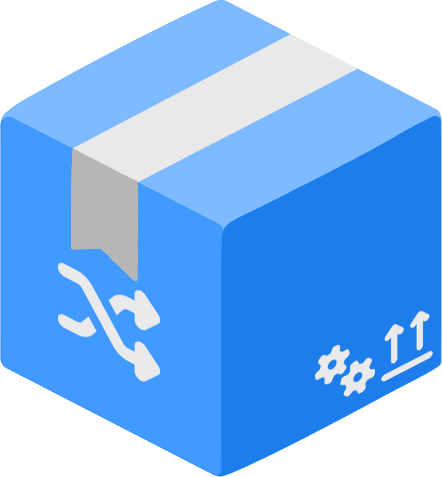

<h1 align="center">korsbox</h1>

<h3 align="center" style="font-size: 150%;">Aiding in cross-compilation of C/C++ code</h3>

---
Korsbox (*kors*, Swedish for "cross") is both a tool and a library to aid users and programming languages cross-compiling C and C++
source code to different platforms. It utilizes [C3](https://c3-lang.org/)'s SDK fetching capabilities to fetch
native SDKs to provide an as-if-native experience on different platforms.

Korsbox also relies on [LLVM](https://llvm.org/)'s [Clang](https://clang.llvm.org/) and [LLD](https://lld.llvm.org/) and
configures them with platform defaults that should get you far, even if there is a need to assist it with a project.
As of now, Korsbox **does not** ship Clang and LLD alongside itself, but that may become a requirement to ensure
reliability.

## TODO
- [ ] provide tests
- [ ] improve argument parsing
- [ ] libkorsbox
- [ ] ensure windows-x64 is good enough
- [ ] provide windows-aarch64 target
- [ ] setup subcommand to setup symlinks
- [ ] meson toolchain file generation
- [ ] doctor subcommand to ensure everything is set up correctly
- [ ] provide macos-aarch64 and macos-x64 targets
- [ ] find good enough base for linux*, etc
- [ ] ensure korsbox tool works on other systems than linux

*musl won't always do for Linux, e.g. graphical applications relying on dlopen

## Artwork & Branding
The Korsbox logo is based on Google Noto Emoji (SIL OFL 1.1) and Font Awesome Free icons (CC BY 4.0 / SIL OFL 1.1), modified under the terms of their respective open-source licenses.
